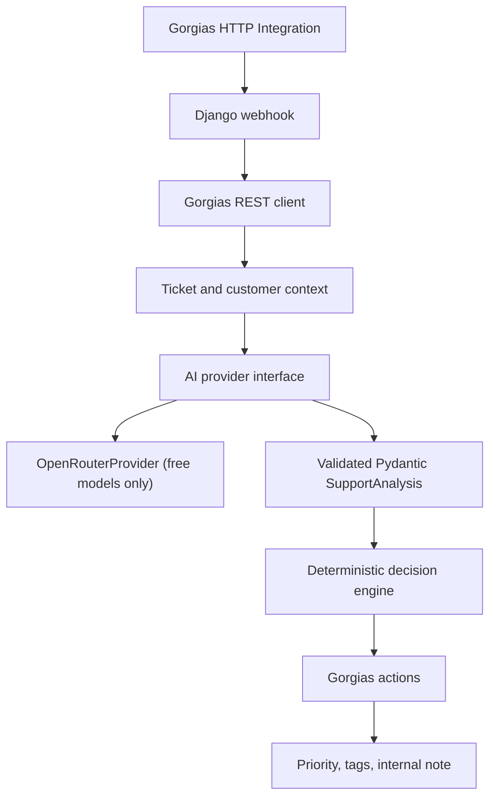

# Gorgias AI Support Automation

A small production-style Django demo for ecommerce support automation. The service receives Gorgias ticket events, fetches full ticket and customer context, asks a provider-agnostic AI layer for structured analysis, applies deterministic Python business rules, and writes operational output back to Gorgias as priority, tags, and an internal note.

The project is intentionally compact so it can be reviewed quickly by a technical hiring manager and deployed on a lightweight free Python hosting service.

## Business Problem

Ecommerce support teams often receive repetitive order-status, shipping-delay, and product-issue questions. This demo shows how AI can assist agents without taking risky autonomous actions:

- classify the latest meaningful customer message
- summarize the support issue
- recommend an agent-reviewed reply
- enforce escalation rules in deterministic code
- write a clean internal note back to Gorgias

No customer-facing message is sent automatically in this MVP.

## Architecture



Main separation of concerns:

- `support/views.py` handles webhook parsing, validation, idempotency, and loop prevention.
- `support/services/gorgias.py` wraps Gorgias REST API calls.
- `support/services/ai/base.py` defines the provider interface.
- `support/services/ai/openrouter.py` implements OpenRouter chat completions.
- `support/schemas.py` validates structured AI output with Pydantic.
- `support/services/decision_engine.py` applies deterministic business rules.
- `support/services/processor.py` orchestrates fetching, AI analysis, rules, and Gorgias actions.

## Safety and Human-in-the-Loop Design

AI classification is advisory. Final priority, tags, and action selection are decided by Python rules.

Safety-related language is escalated in code even if the model recommends a low-risk action. The service never auto-closes tickets and never sends a customer-facing response.

The demo currently uses a free inference provider to avoid unnecessary demo costs. The AI layer is provider-agnostic and can be replaced with Anthropic Claude without changing the Gorgias workflow or decision engine.

## Demo Scenarios

| Scenario | Rule outcome |
| --- | --- |
| Order status, paid and fulfilled with tracking | Low priority, `AI_ORDER_STATUS`, `AI_LOW_RISK`, internal note, human review |
| Shipping delay with unfulfilled order | High priority, `AI_SHIPPING_DELAY`, `AI_ESCALATED`, no false shipped claim |
| Product defect or warranty issue | High priority, `AI_PRODUCT_DEFECT`, `AI_WARRANTY_REVIEW`, no automatic refund or replacement promise |
| Safety issue | Critical priority, `AI_SAFETY`, `AI_ESCALATED`, immediate human review |

## Local Setup

```powershell
cd "C:\Users\Marko Yoga\Desktop\Gogias automation"
python -m venv .venv
.\.venv\Scripts\Activate.ps1
python -m pip install --upgrade pip
pip install -r requirements.txt
copy .env.example .env
python manage.py migrate
pytest
python manage.py runserver 127.0.0.1:8000
```

Health check:

```powershell
curl http://127.0.0.1:8000/health/
```

Example Gorgias webhook simulation:

```powershell
curl -Method POST http://127.0.0.1:8000/api/webhooks/gorgias/ `
  -ContentType "application/json" `
  -Body '{"event_id":"demo-1","ticket_id":12345}'
```

## Environment Variables

Create a local `.env` from `.env.example`. Never commit `.env`.

| Variable | Purpose |
| --- | --- |
| `DJANGO_ENV` | `development` or `production` |
| `DJANGO_DEBUG` | Defaults to `False`; set `True` only locally |
| `DJANGO_SECRET_KEY` | Required for production |
| `DJANGO_ALLOWED_HOSTS` | Comma-separated hostnames |
| `GORGIAS_BASE_URL` | Example: `https://your-store.gorgias.com` |
| `GORGIAS_USERNAME` | Gorgias API username |
| `GORGIAS_API_KEY` | Gorgias API key |
| `AI_PROVIDER` | Currently only `openrouter` |
| `OPENROUTER_API_KEY` | OpenRouter API key |
| `OPENROUTER_MODEL` | Recommended: `openrouter/free`; explicit free variants containing `:free` are also allowed |
| `EXTERNAL_REQUEST_TIMEOUT_SECONDS` | Timeout for Gorgias and AI HTTP calls |
| `WEBHOOK_IDEMPOTENCY_TTL_SECONDS` | Duplicate webhook suppression window |
| `INTEGRATION_NAME` | Used for loop-prevention checks |
| `GORGIAS_INTEGRATION_EMAIL` | Optional integration sender email |
| `GORGIAS_INTEGRATION_USER_ID` | Optional integration user id |

## Tests

Run:

```powershell
pytest
```

The test suite mocks Gorgias and AI calls. It covers:

- health endpoint
- valid and malformed webhooks
- order status
- shipping delay
- product defect
- safety issue override
- malformed AI output
- Gorgias API failure
- webhook loop prevention
- AI provider failure

## Deployment

This project is suitable for a small Python WSGI web service using SQLite and environment variables.

Production start command:

```bash
gunicorn config.wsgi:application
```

Recommended lightweight configuration:

- Python web service
- install command: `pip install -r requirements.txt`
- start command: `gunicorn config.wsgi:application`
- health check path: `/health/`
- set `DJANGO_ENV=production`
- set `DJANGO_DEBUG=False`
- set `DJANGO_SECRET_KEY` to a secure generated value
- set `DJANGO_ALLOWED_HOSTS` to the deployed domain
- set Gorgias and OpenRouter environment variables in the host dashboard

No PostgreSQL, Redis, Celery, Docker orchestration, or paid AI model is required for this MVP.

## Switching to Anthropic Claude Later

Add a new provider class, for example `AnthropicProvider`, implementing the `AIProvider` protocol in `support/services/ai/base.py`. Then update `support/services/ai/factory.py` to return that provider when `AI_PROVIDER=anthropic`.

No changes should be needed in:

- webhook handling
- Gorgias client
- decision engine
- business rules

## Known Limitations

- Processing is synchronous for simplicity.
- Idempotency uses Django's local memory cache, which is acceptable for a small demo but not durable across restarts.
- The Gorgias API methods are intentionally small and should be expanded after confirming exact production account payloads.
- The service writes internal notes only; it does not send customer-facing replies.
- The OpenRouter provider accepts `openrouter/free` and explicit `:free` model variants, rejects paid model names, and has no paid fallback.
